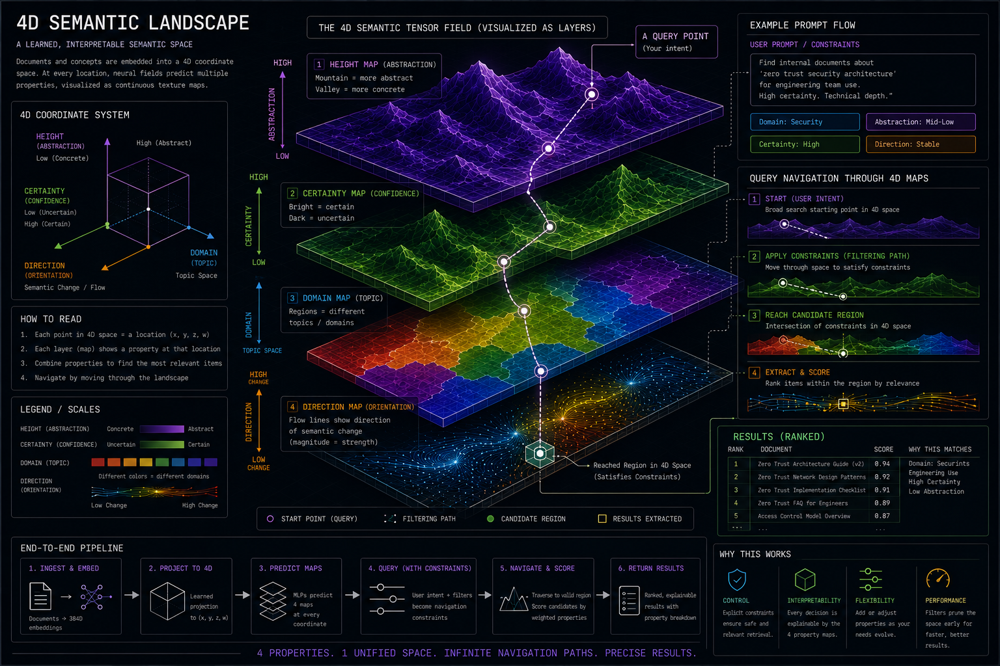

# 4D Texture Retrieval System

<p align="center">
  
  <br>
  <em>Policy-first semantic retrieval using supervised semantic terrain and controllable property maps.</em>
</p>

## Overview

Most retrieval systems optimize for nearest-neighbor similarity.

This project explores a different idea:

What if semantic retrieval behaved more like navigation across structured terrain instead of lookup inside opaque vector space?

The 4D Texture Retrieval System treats embeddings as coordinates inside supervised semantic texture maps:

- Height → abstraction level
- Certainty → confidence / reliability
- Domain → topic region
- Direction → semantic flow / trajectory

Instead of asking only:

> “What is most similar?”

the system asks:

> “What is allowed, reliable, domain-correct, appropriately abstract, and semantically aligned?”

The architecture is designed for:

- policy-aware retrieval
- controllable RAG
- enterprise knowledge systems
- agent memory
- explainable ranking
- constrained semantic search

---

## Core Architecture

```txt
Content + Metadata
        ↓
Policy Gate
        ↓
Embedding Projection
        ↓
4D Semantic Texture Space
        ↓
Property Maps
        ↓
Weighted Multi-Objective Ranking
        ↓
Safe Ranked Results
